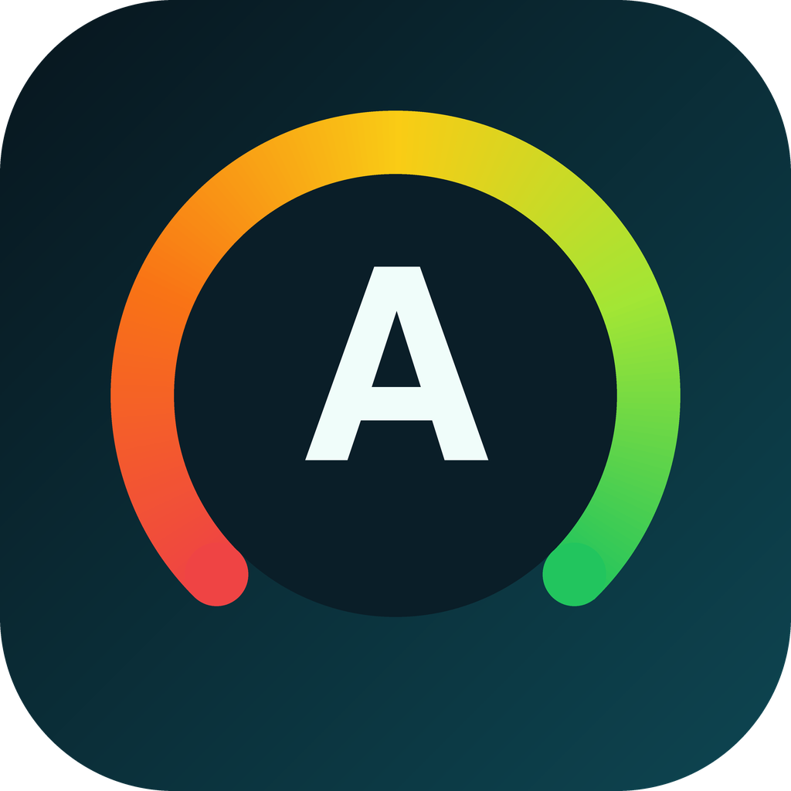

# SiteGrade

[](https://opensource.org/license/mit/)
[](https://discord.gg/8Jm4v89VAu)



## About

A dApp can have a flawless contract and still hurt its users through the page they load it from: no clickjacking protection, a missing Content-Security-Policy, forms a screen reader cannot use. Directories, grant programmes and wallets that list dApps have no neutral way to tell, so they either skip the question or trust a self-reported badge.

**SiteGrade** puts that question on chain. You register the URL of a frontend, anyone can trigger an audit, and every GenLayer validator independently loads the page itself. Consensus is reached on a small set of coarse pass/fail results, which the contract turns into an A-F grade for security headers, an A-F grade for accessibility, and an overall grade (the weaker of the two). A directory, grant programme or another contract then calls `meets_grade(site_id, "C")` before it links or funds a frontend.

**Live demo:** [sitegrade-bars26.vercel.app](https://sitegrade-bars26.vercel.app). Reads work without a wallet; registering or re-auditing a site needs MetaMask on GenLayer Studio.
**Deployed contract:** [`0x95BF6dc4Ef493eacC002fEA5E792bf9b925525bB`](https://explorer-studio.genlayer.com/address/0x95BF6dc4Ef493eacC002fEA5E792bf9b925525bB) on GenLayer Studio.

## What an audit looks at

**Security headers (6)**

| Check | Passes when |
|---|---|
| `hsts` | `Strict-Transport-Security` with `max-age` of at least 180 days |
| `csp` | A CSP with `script-src` or `default-src`, without `*` and without `'unsafe-eval'` |
| `nosniff` | `X-Content-Type-Options: nosniff` |
| `framing` | `X-Frame-Options` or a CSP `frame-ancestors` directive |
| `referrer` | A `Referrer-Policy` header |
| `no_mixed_content` | No `http://` scripts, images, frames, stylesheets or media |

**Accessibility (10)**

| Check | Passes when |
|---|---|
| `lang` | `<html lang>` is set |
| `title` | A non-empty `<title>` |
| `main_landmark` | The page has a `<main>` (or `role="main"`) |
| `single_h1` | Exactly one `<h1>` |
| `heading_order` | No skipped heading levels |
| `img_alt` | Every `` has an `alt` attribute |
| `form_labels` | Every input has a `<label>`, `aria-label` or `aria-labelledby` |
| `control_names` | Every link and button has an accessible name |
| `zoomable` | The viewport does not block pinch-zoom |
| `labels_meaningful` | An LLM judges link and image labels descriptive (not "click here" or file names) |

A check that does not apply (a page with no forms, no images) is `null` and is left out of the score rather than counted as a pass. Each area's score is the percentage of applicable checks that passed; `A` is 90+, `B` 80+, `C` 65+, `D` 50+. A page validators cannot load scores 0 in both areas.

## Verified live on GenLayer Studio

Real pages, real validator consensus (real HTTP fetches, `ACCEPTED`):

| Page | Security | Accessibility | Overall |
|---|---|---|---|
| W3C WAI "bad" demo, **before** its accessibility fixes | 67% | 40% | **F** |
| W3C WAI "bad" demo, **after** the fixes | 67% | 80% | **C** |
| example.com | 17% | 80% | **F** |
| FeedWarden's own dashboard | 33% | 100% | **F** |
| SiteGrade's own dashboard | 100% | 100% | **A** |

The W3C pair is a useful sanity check: the same demo page before and after its published accessibility repairs moves from 40% to 80% accessibility, and the grade follows. FeedWarden scored 100% on accessibility and 33% on security, which is why SiteGrade's own Next.js config now sends a CSP, `nosniff`, `X-Frame-Options`, a referrer policy and HSTS.

## How it works

1. **`register_site(url)`** validates the URL, loads the page once under consensus and **refuses pages that do not answer HTTP 200 with HTML**, then stores the first grade.
2. **`audit_site(site_id)`** is permissionless. Validators re-load the page and the contract stores the new scores, grades, the list of failed checks, the per-check results and a rolling history of the last 10 audits.
3. **Views**: `get_site`, `get_grade`, `meets_grade`, `get_history`, `list_sites`, `list_sites_by_owner`.

## Design notes

- **Consensus on booleans, not on pages.** Two validators fetching a page a second apart can see different bytes (nonces, timestamps, A/B copy), so the whole audit runs inside one `gl.eq_principle.strict_eq` block that returns only coarse booleans.
- **The LLM only ever answers a JSON boolean, and it is re-checked.** The verdict must be a real `true`/`false`; a string such as `"false"` (truthy in Python) is rejected rather than coerced. The LLM is called only when the page has labels to judge, and it is the only non-mechanical check. It is the same discipline as [`bars26/genlayer-verdict`](https://github.com/bars26/genlayer-verdict) and [`bars26/genlayer-frontendsentinel`](https://github.com/bars26/genlayer-frontendsentinel).
- **Raw HTML first, rendered HTML only for empty SPA shells.** `gl.nondet.web.render(mode="html")` returns only the cleaned body content: no `<html lang>`, no `<title>`, no viewport meta. Judging a page from it made `example.com` and a fully accessible Next.js app look like they had no language and no title. The contract therefore parses the raw response body (which also gives it the response headers), and falls back to the rendered DOM only when the raw HTML is a near-empty shell (a client-rendered SPA), where the rendered content is the more honest thing to grade.
- **A CSP has to actually restrict.** Having a `Content-Security-Policy` header is not enough: it must define `script-src` or `default-src`, and a `*` source or `'unsafe-eval'` fails it.
- **Overall grade is the weaker area.** A site cannot average a hole away with a strong other half.
- **Registration is a real probe**, so the registry does not fill with dead links. Registration reverts with a readable message if the page does not load.
- **No payable methods, no funds held.** A pure attestation registry: no funded wallet is needed to exercise the full flow.

## What's included

- **`contracts/site_grade.py`**: the Intelligent Contract described above
- **39 direct-mode tests** (`tests/direct/test_site_grade.py`) covering good and bad page fixtures, each header rule, each accessibility rule, the CSP wildcard and `unsafe-eval` cases, the LLM-boolean guard, SPA-shell selection, history capping, permissionless audits, `meets_grade`, and owner scoping
- **A working Next.js frontend** (`frontend/`): sites table with expandable per-check reports and fix hints, grade distribution with the most common misses, an integrator gate card, and a register-a-site form
- Contract linting, a GitHub Actions CI workflow, and a deploy script (`deploy/deployScript.ts`)

## Requirements
- Python >= 3.12
- [GenLayer CLI](https://github.com/genlayerlabs/genlayer-cli): `npm install -g genlayer`
- GenLayer Studio (for integration tests and deployment): [docs](https://docs.genlayer.com/developers/intelligent-contracts/tooling-setup#using-the-genlayer-studio) or the hosted [Studio](https://studio.genlayer.com/)

## Project Structure

```
contracts/
  site_grade.py             # The SiteGrade Intelligent Contract
tests/
  direct/                   # Fast in-memory tests (no Studio required)
    test_site_grade.py
frontend/                   # Next.js app (TypeScript, TanStack Query, Radix UI)
deploy/                     # TypeScript deployment scripts
assets/                     # Logo
```

## Quick Start

### 1. Set up the Python environment

```shell
python3 -m venv .venv
source .venv/bin/activate
pip install -r requirements.txt
```

### 2. Lint the contract

```shell
genvm-lint check contracts/site_grade.py
```

### 3. Run the direct-mode tests

```shell
python -m pytest tests/direct/ -v
```

### 4. Deploy the contract

```shell
genlayer network set studionet
genlayer deploy --contract contracts/site_grade.py
```

### 5. Grade a page from the CLI

```shell
genlayer write <CONTRACT> register_site --args "https://your-dapp.xyz"
genlayer write <CONTRACT> audit_site --args site_0
genlayer call <CONTRACT> get_site --args site_0
genlayer call <CONTRACT> meets_grade --args site_0 C
```

### 6. Run the frontend

```shell
cp frontend/.env.example frontend/.env
# set NEXT_PUBLIC_CONTRACT_ADDRESS to your deployed contract
cd frontend && npm install && npm run dev
```

Open http://localhost:3000. Reads (sites, grades, gate lookup) work without a wallet; registering and re-auditing need MetaMask connected to the GenLayer network.

## License
This project is licensed under the MIT License. See [LICENSE](LICENSE).
